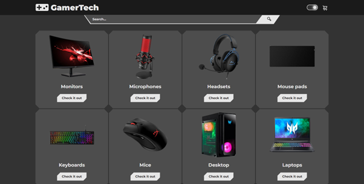
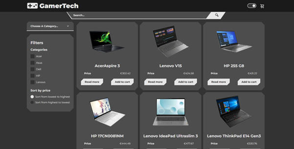
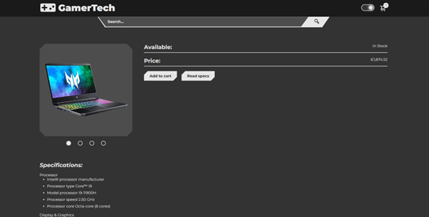
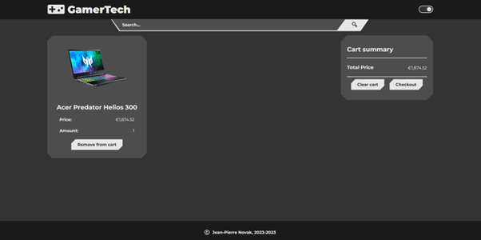
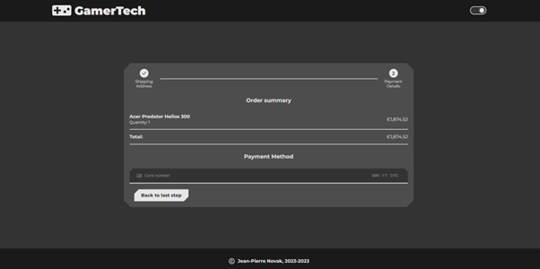

# Webshop

## Description

A React based webshop using [Commerce.js](https://commercejs.com) for its database, [Stripe.js](https://stripe.com/docs/js) for the payments and [Email.js](https://www.emailjs.com) for sending "newstellers". It is a virtual tech store that offers a wide range of gaming and tech products. Whether you're a gaming enthusiast or tech-savvy individual, this webshop provides a convenient platform to explore and purchase the latest gadgets and gaming equipment.

## Features

- Product selection by category: allows the user to select a category and display all the products under that category
- Product selection by subcategory: allows the user to select the subcategory or subcategories and display all items with that subcategory
- Sorting by price: items can be displayed by ascending or descending price
- Checking product informaiton: allows the user to check the specs of the selected product
- Add to cart: adds item or items to the cart
- Remove from cart: removes item or items from the cart
- Clear cart: removes all items from the cart
- Checkout: gives the user the abillity to enter their shipping and card information
- Search: find product by entering a keyword in the search bar
- Responsive Design: Access the webshop on various devices, including desktops, tablets, and smartphones.

## Live demo

You can browse the GamerTech Webshop by visiting the [live demo](https://gamertech-project.netlify.app)

## How to run the app locally

If you want to run the app localy:

#### 1. Clone the repository

- HTTPS: `git clone https://github.com/Zack1808/webshop.git`
- SSH: `git clone git@github.com:Zack1808/webshop.git`
- GitHub CLI: `gh repo clone Zack1808/webshop`

#### 2. Enter the project directory

`cd webshop`

#### 3. Allow the app to install the necessary packages (Node.js has to be installed on the device)

`npm install`

#### 4. Settup the API key

Within the project directory, create the .env file. In there create the variable REACT_APP_YT_API_KEY

`REACT_APP_COMMERCE_API_KEY=yourPublicCommerceJsAPIkey`
`REACT_APP_EMAIL_SERVICE_ID=yourEmailJsServiceId`
`REACT_APP_EMAIL_TEMPLATE_ID=yourEmailJsTemplateId`
`REACT_APP_EMAIL_PUBLIC_KEY=yourEmailJsPublicKey`
`REACT_APP_STRIPE_API_KEY=yourStripeJsAPIkey`

#### 5. start the app

`npm start`

After execution, the localhost server will startup and a browser window will open, previewing the webshop page.

## Contribution

Contributions to the webshop project are welcome. If you find any issues or want to add new features, feel free to create a pull request. Make sure to follow the project's coding conventions and provide detailed information about your changes.

## Contact

If you have any questions or suggestions, you can reach me via:

- Mail: jeanpierrenovak23@gmail.com
- My portfolio: [jeanpierrenovak.netlify.app](https://jeanpierrenovak.netlify.app)

---

Happy shopping!
